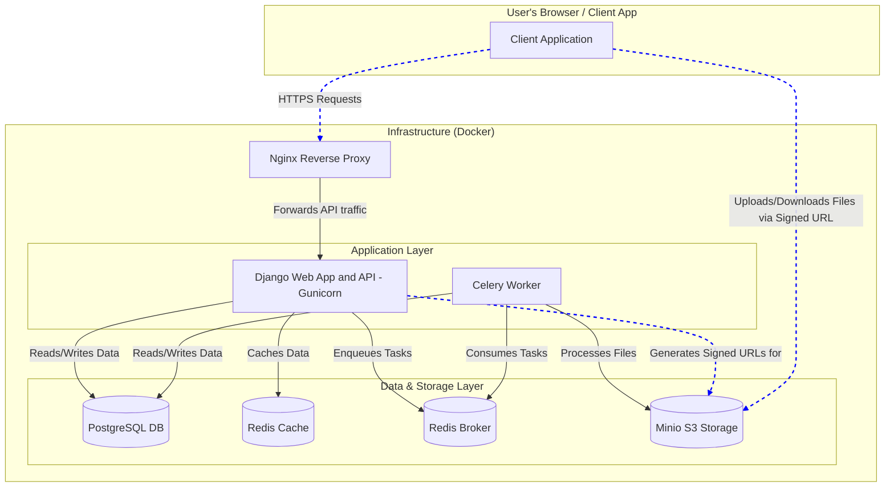

# System Architecture

This document provides a high-level overview of the project's technical architecture. The system is designed as a set of containerized services that work together to deliver a scalable and maintainable music streaming platform.

## 1. Component Diagram

The following diagram illustrates the main components of the system and how they interact.

## 2. Service Descriptions

Each component in the diagram is a containerized service managed by Docker Compose. Here are their responsibilities:

### `proxy` (Nginx)
-   **Role:** The entry point for all incoming HTTP traffic.
-   **Responsibilities:**
    -   Acts as a reverse proxy, forwarding API requests to the `web` service.
    -   Serves static files (`staticfiles/`) and would serve a frontend application's build files (`frontend/build/`).
    -   Handles SSL termination in a production environment.

### `web` (Django / Gunicorn)
-   **Role:** The core backend application.
-   **Responsibilities:**
    -   Implements the entire REST API for authentication, music catalog, streaming, social features, etc.
    -   Handles business logic and data validation.
    -   Communicates with the database for persistent storage.
    -   Uses Redis for caching to improve performance.
    -   Enqueues long-running or intensive tasks (like audio transcoding) onto the Celery queue via the Redis broker.

### `worker` (Celery)
-   **Role:** Asynchronous task processor.
-   **Responsibilities:**
    -   Listens for tasks on the Redis message broker.
    -   Executes heavy jobs in the background without blocking the API.
    -   **Examples:** Transcoding uploaded audio files into different bitrates (HLS), sending email notifications, re-calculating analytics data.

### `db` (PostgreSQL)
-   **Role:** Primary data store.
-   **Responsibilities:**
    -   Stores all relational data: user accounts, artists, albums, tracks, playlists, social connections, etc.
    -   Leverages advanced features like `pg_trgm` and Full-Text Search for efficient and powerful search capabilities.

### `redis` (Redis)
-   **Role:** In-memory data store with a dual purpose.
-   **Responsibilities:**
    -   **Celery Broker:** Manages the queue of tasks to be processed by the Celery workers.
    -   **Application Cache:** Caches frequently accessed data (e.g., query results, user sessions) to reduce database load and improve API response times.

### `minio` (S3-Compatible Object Storage)
-   **Role:** Storage for large media files.
-   **Responsibilities:**
    -   Stores all user-uploaded content, primarily master audio files and album art.
    -   Stores processed media, such as HLS playlists and audio segments generated by the Celery worker.
    -   The Django application generates secure, pre-signed URLs to allow clients to directly upload to and download from this service, offloading bandwidth from the main application.
